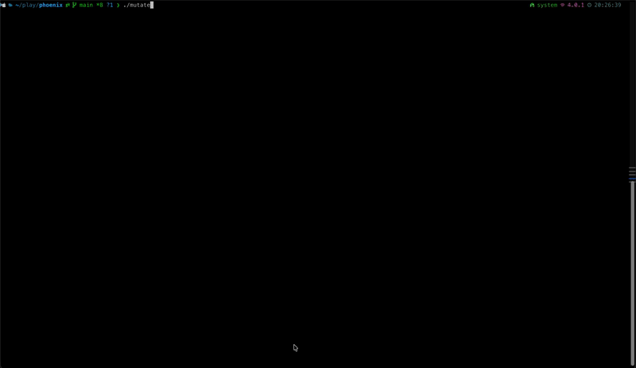

# muti



[](https://github.com/fibegg/muti/actions/workflows/ci.yml)
[](https://goreportcard.com/report/github.com/fibegg/muti)
[](https://opensource.org/licenses/MIT)

Language-agnostic mutation testing engine powered by [tree-sitter](https://tree-sitter.github.io/tree-sitter/).

Mutates source code in target directories and runs a probe command (your test suite) to determine if mutations are detected (**killed**) or survive (**indicating poor test coverage**).

## Features

- **Language-agnostic** — Ruby, Go, Python, JavaScript, TypeScript out of the box
- **14 mutation operators** — boolean, equality, logical, conditional, arithmetic, and more
- **Generic tool pipeline** — pipe mutation JSON to any command (`echo`, `curl`, custom scripts)
- **Single binary** — no runtime dependencies except `git`

## Quick Start

```bash
# Build from source
make build

# Or install directly
go install github.com/fibegg/muti/cmd/muti@latest

# Or pull the Docker image
docker pull ghcr.io/fibegg/muti:latest

# Run mutation testing
muti --dirs src -- go test ./...

# Test mode (apply mutations, skip tests, inspect changes)
muti --test --dirs app --rounds 3

# Pipe mutations to a webhook
muti --tool 'curl -s -X POST https://api.example.com/mutations -H "Content-Type: application/json" -d @-' -- make test
```

## Installation

### From Source

**Requirements:** Go 1.21+, `git`, C compiler (for CGO/tree-sitter)

```bash
git clone https://github.com/fibegg/muti.git
cd muti
make build          # → ./muti binary
make install        # → $GOPATH/bin/muti
```

### Docker

The compiled binary lives at **`/usr/local/bin/muti`** inside the image.

```bash
# Pull from GitHub Container Registry
docker pull ghcr.io/fibegg/muti:latest

# Run against your project
docker run --rm -v "$(pwd):/workspace" -w /workspace ghcr.io/fibegg/muti:latest \
  --dirs src --test --rounds 3

# With probe command
docker run --rm -v "$(pwd):/workspace" -w /workspace ghcr.io/fibegg/muti:latest \
  --dirs src --rounds 5 -- go test ./...

# Extract the binary from the image to use locally
docker create --name muti-tmp ghcr.io/fibegg/muti:latest
docker cp muti-tmp:/usr/local/bin/muti ./muti
docker rm muti-tmp
```

### GitHub Releases

Pre-built binaries for Linux and macOS (amd64/arm64) are available on the [Releases page](https://github.com/fibegg/muti/releases).

## Usage

```
muti [flags] [-- PROBE_COMMAND...]
```

Everything after `--` is your test command (the "probe"). If tests fail → mutation killed ✓. If tests pass → mutation survived (poor coverage).

### Flags

| Flag | Short | Default | Description |
|------|-------|---------|-------------|
| `--dirs` | `-d` | `.` | Directories to mutate (comma-separated) |
| `--extensions` | `-e` | auto | File extensions to target |
| `--lang` | `-l` | auto | Force language (`ruby`, `go`, `python`, `js`, `ts`) |
| `--rounds` | `-r` | `10` | Number of mutation rounds |
| `--mutations` | `-m` | random 1-5 | Mutations per round |
| `--operator` | `-o` | all | Use only this operator |
| `--skip-operators` | `-s` | none | Comma-separated operators to skip |
| `--test` | | `false` | Test mode: apply mutations, skip probe, keep changes |
| `--tool` | `-t` | `echo` | Command to pipe each mutation JSON to |
| `--output-dir` | | none | Also save mutation files to directory |
| `--verbose` | `-v` | `false` | Debug output |

### Subcommands

```bash
muti list-operators    # Show all 14 mutation operators
muti list-languages    # Show supported languages and extensions
muti version           # Print version
```

## Mutation Operators

| Operator | Description |
|----------|-------------|
| `swap_boolean` | `true` ↔ `false` |
| `negate_equality` | `==` ↔ `!=` |
| `swap_logical` | `&&` ↔ `\|\|`, `and` ↔ `or` |
| `flip_conditional` | Swap if/else branches |
| `inject_early_return` | Insert `return nil/None/null` at function start |
| `remove_statement` | Remove random statement from function body |
| `swap_integer` | `0` ↔ `1` |
| `empty_string` | Replace string literal with `""` |
| `null_return` | `return expr` → `return nil/None/null` |
| `swap_comparison` | `>` ↔ `<`, `>=` ↔ `<=` |
| `remove_guard_clause` | Remove early-return guard clause |
| `remove_error_handler` | Remove rescue/except/catch blocks |
| `replace_arg_with_null` | Replace method argument with null |
| `swap_arithmetic` | `+` ↔ `-`, `*` ↔ `/` |

## Supported Languages

| Language | Extensions |
|----------|-----------|
| Ruby | `.rb` |
| Go | `.go` |
| Python | `.py` |
| JavaScript | `.js`, `.jsx`, `.mjs`, `.cjs` |
| TypeScript | `.ts`, `.tsx` |

Adding a new language requires a tree-sitter grammar dependency + a registry entry. See [CONTRIBUTING.md](CONTRIBUTING.md).

## Tool Pipeline

Each mutation result is serialized as JSON and piped to `--tool`'s stdin:

```json
{
  "file": "app/models/user.rb",
  "operator": "swap_boolean",
  "description": "Swapped `true` → `false`",
  "line": 42,
  "column": 8,
  "original": "true",
  "mutated": "false",
  "diff": "...",
  "probe_result": "killed",
  "probe_exit_code": 1
}
```

**Examples:**

```bash
# Default: print to stdout
muti -- make test

# Send to a server
muti --tool 'curl -s -X POST https://api.example.com/mutations -H "Content-Type: application/json" -d @-' -- make test

# Append to a file
muti --tool 'tee -a mutations.jsonl' -- make test

# Custom processing script
muti --tool './process_mutation.sh' -- make test
```

All `--dirs` must be within the same git repository.

## Setting Up CI

The included `.github/workflows/ci.yml` provides:

- **Lint + Test** on every push and PR
- **Multi-arch Docker build** (linux/amd64, linux/arm64) pushed to `ghcr.io` on every push to `main`
- **Binary releases** via GoReleaser on tag push

### Before First Push

1. **Create the GitHub repo:**
   ```bash
   gh repo create fibegg/muti --public --source=. --remote=origin
   ```

2. **Enable GitHub Container Registry** — no extra setup needed, `GITHUB_TOKEN` has `packages:write` permission by default.

3. **Push and verify CI:**
   ```bash
   git push -u origin main
   ```

4. **For releases**, tag and push:
   ```bash
   git tag v0.1.0
   git push origin v0.1.0
   ```
   GoReleaser will build cross-compiled binaries and create a GitHub Release automatically.

## Development

```bash
make help          # Show all available targets
make all           # lint + test + build
make test          # Run tests with race detector
make lint          # Run golangci-lint
make cover         # Generate coverage report
make smoke         # Build + quick smoke test
make docker        # Build Docker image locally
make release-dry   # Dry-run GoReleaser
```

## License

[MIT](LICENSE)
